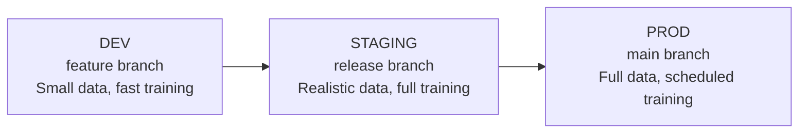

# Environments & Promotion

This page explains how the repository manages multiple Snowflake environments
and how changes are promoted between them.

## Environment topology

The repository supports three environments:

| Environment | Purpose | Config overlay |
|---|---|---|
| **DEV** | Development and experimentation. Fast iteration, smaller data. | `dev.override.yaml` |
| **STAGING** | Pre-production validation. Realistic data, full configuration. | `staging.override.yaml` |
| **PROD** | Production. Full data, scheduled pipelines, monitoring. | `prod.override.yaml` |

## Schema layout per environment

Each environment has its own set of Snowflake schemas:

```
PUDO_MLOPS (database)
├── SHARED_DATA                    # Shared across all environments
├── FEATURE_STORE_DEV              # Dev feature store
├── FEATURE_STORE_STAGING          # Staging feature store
├── FEATURE_STORE_PROD             # Production feature store
├── MODEL_REGISTRY_DEV             # Dev model registry
├── MODEL_REGISTRY_STAGING         # Staging model registry
├── MODEL_REGISTRY_PROD            # Production model registry
├── PUDO_DEV                       # Dev project schema
├── PUDO_STAGING                   # Staging project schema
└── PUDO_PROD                      # Production project schema
```

The `SHARED_DATA` schema is shared because it contains the source data that
all environments read from. Feature stores, model registries, and project
schemas are isolated per environment.

## Environment selection

The current mechanism uses the **Git branch name** to determine the target
environment:

| Git branch pattern | Environment |
|---|---|
| `dev`, `feature/*` | `DEV` |
| `staging`, `release/*` | `STAGING` |
| `main` | `PROD` |

When you run a deploy command, the script:

1. Reads the current Git branch.
2. Resolves the environment name.
3. Loads the base configuration and merges the environment overlay.
4. Connects to Snowflake using the resolved environment's credentials.

## Configuration overlay system

Configuration uses a **Kustomize-style** overlay pattern:

```yaml
# config/training/base.yaml (shared defaults)
train_days: 90
n_estimators: 500
learning_rate: 0.05
max_depth: 6

# config/training/dev.override.yaml (fast iteration)
train_days: 30
n_estimators: 50

# config/training/prod.override.yaml (full training)
train_days: 365
n_estimators: 1000
learning_rate: 0.01
max_depth: 8
```

Override files only need to contain values that differ from the base. This
ensures:

- **Single source of truth**: base configuration defines the canonical
  defaults.
- **Environment-specific tuning**: overrides adjust parameters without
  duplicating the full configuration.
- **Auditability**: it is clear what differs between environments.

## Promotion flow

A typical promotion flow through environments:



### DEV → STAGING

1. Feature branch is merged into a release branch.
2. Engineer runs the deploy targets from the release branch; the STAGING
   environment is updated.
3. Training runs against staging data.
4. Model metrics are compared to the production baseline.

### STAGING → PROD

1. Release branch is merged into `main`.
2. Engineer runs the deploy targets from `main`; the PROD environment is
   updated.
3. Production DAGs are updated.
4. Scheduling is activated.

## Per-component `.env` files

Each component has its own `.env` file for Snowflake connection credentials:

```dotenv
# hub/.env
SNOWFLAKE_ACCOUNT=my-account
SNOWFLAKE_USER=my-user
SNOWFLAKE_ROLE=PUDO_DEV_ROLE     # Changes per environment
SNOWFLAKE_WAREHOUSE=PUDO_DEV_WH  # Changes per environment
```

For local development, you can symlink `.env` files across components:

```bash
cd projects/pudo
ln -s ../../hub/.env .env
```

## See also

- [Repo Layers & Ownership](repo-layers.md) for the architectural context.
- [Feature Store](feature-store.md) for how feature stores are isolated per
  environment.
