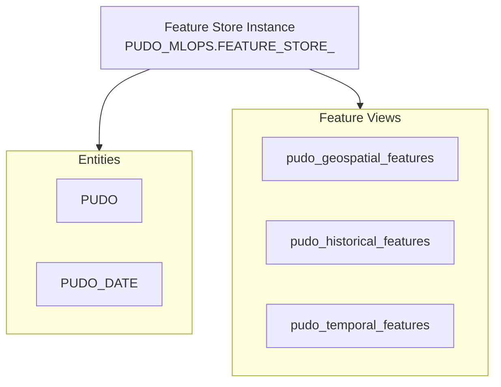

# Feature Store

This page explains how the Snowflake Feature Store is used in this repository.

## What is a Feature Store?

A Feature Store is a centralised repository for ML features that provides:

- **Discoverability**: engineers can find and reuse existing features.
- **Consistency**: the same feature computations are used in both training and
  inference, preventing training-serving skew.
- **Point-in-time correctness**: feature values are looked up as of a specific
  timestamp, preventing data leakage.
- **Versioning**: features evolve over time without breaking downstream
  consumers.

## Snowflake Feature Store architecture

The Snowflake Feature Store is built on native Snowflake objects:



## Entities

Entities define the primary keys that features are organised around:

| Entity | Key(s) | Description |
|---|---|---|
| `PUDO` | `PUDO_ID` | A single PUDO location. |
| `PUDO_DATE` | `PUDO_ID`, `DATE` | A PUDO on a specific date (composite key for temporal features). |

Entities establish the granularity at which features are computed and joined.

## Feature Views

Feature views are versioned collections of computed features:

| Feature view | Features | Source data |
|---|---|---|
| `pudo_geospatial_features` | Nearby competing PUDOs, total nearby capacity | PUDO locations |
| `pudo_historical_features` | Historical parcel volumes, delivery success rates | Parcels, delivery attempts |
| `pudo_temporal_features` | Daily demand, day-of-week patterns | Parcels, occupancy |

### Snowflake-managed vs. external feature views

This repository uses **Snowflake-managed** feature views:

- The Feature Store owns the SQL that computes the features.
- Feature values are materialised and stored by Snowflake.
- Point-in-time lookups are handled natively via ASOF JOIN.

External feature views (e.g., managed by dbt) are not used but are a valid
alternative for teams with existing transformation pipelines.

## Point-in-time correctness

Point-in-time correctness prevents **data leakage**: using future information
to make past predictions.

### The problem

Without point-in-time enforcement:

```
Training row for (PUDO_1, 2024-01-15):
  Feature: avg_parcels_last_7d = 150   ← computed using data from 2024-01-09 to 2024-01-15
  Target:   actual_capacity = 160

BUT: the "avg_parcels_last_7d" feature might have been computed using
     data that wasn't available until 2024-01-16 → data leakage!
```

### The solution: ASOF JOIN

The Feature Store uses ASOF JOIN to look up feature values **as of** the
prediction timestamp:

```sql
-- For each (PUDO, date) in the spine, find the most recent feature
-- values that were available at or before that date.
SELECT *
FROM spine s
ASOF JOIN feature_view fv
  MATCH_CONDITION s.timestamp >= fv.timestamp
  ON s.pudo_id = fv.pudo_id
```

This guarantees that only information available at prediction time is used.

## Feature versioning

Feature views are versioned. When you deploy a feature view:

- If the definition has changed, a new version is created.
- If the definition is unchanged, the existing version is reused.
- Downstream consumers (training, inference) reference specific versions
  through configuration.

### Dual-version system

The repository uses a dual-version system:

1. **Feature Store version**: what versions are *available* in the Feature
   Store. Controlled by `config/feature_view/feature_store/*.yaml`.
2. **Consumption version**: what versions ML pipelines *actually use*.
   Controlled by `config/feature_view/feature_views/*.yaml`.

This separation allows feature engineers to publish new versions without
immediately affecting production pipelines.

## Namespacing

Features are namespaced to distinguish shared from project-specific:

| Prefix | Scope | Example |
|---|---|---|
| `SHARED__` | Cross-project, promoted to shared Feature Store | `SHARED__pudo_geospatial` |
| `PUDO__` | Project-specific, stays in project Feature Store | `PUDO__daily_demand` |

Shared features are managed by the hub and are available to all projects.
Project-specific features are owned by the project team.

## Cost considerations

Snowflake-managed feature views use compute resources for materialisation:

- **Compute cost**: warehouse credits are consumed when feature views are
  refreshed or queried.
- **Storage cost**: materialised feature data occupies storage.
- **Optimisation**: use appropriate warehouse sizes and refresh schedules.

## See also

- [Snowflake ML Lifecycle](snowflake-ml-lifecycle.md) for how features fit
  into the broader pipeline.
- [Environments & Promotion](environments-and-promotion.md) for how feature
  stores are managed across environments.
