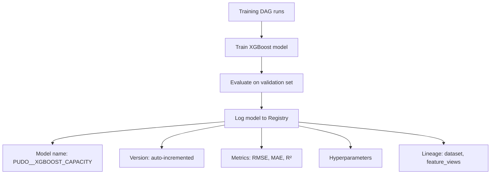

# Model Registry & Training Artifacts

This page explains how trained models are managed in the Snowflake Model
Registry.

## What is the Model Registry?

The Snowflake Model Registry is a centralised store for ML models that
provides:

- **Versioning**: multiple versions of a model coexist.
- **Metadata**: each version carries metrics, hyperparameters, and lineage.
- **Lifecycle management**: models can be promoted through stages
  (development, staging, production).
- **Lineage**: trace which data and features produced a model.

## Model registration flow



## Model versioning

Each training run creates a new model version:

| Attribute | Description |
|---|---|
| Name | `PUDO__<MODEL>` (project-prefixed). |
| Version | Auto-incremented (e.g., v1, v2, v3). |
| Metrics | RMSE, MAE, R² on the validation set. |
| Created | Timestamp of registration. |
| Lineage | References to the dataset and feature views used. |

### Version selection for inference

The inference pipeline loads a model version based on configuration:

```yaml
# config/inference/base.yaml
model:
  name: PUDO__XGBOOST_CAPACITY
  version: latest   # or a specific version number
```

Using `latest` means inference always uses the most recently registered version.
Pinning a specific version provides stability during evaluation periods.

## Training artifacts

Beyond the model itself, the training pipeline produces:

| Artifact | Where it lives | Purpose |
|---|---|---|
| Trained model | Model Registry | Used for inference. |
| Training metrics | Model Registry metadata | Model comparison and selection. |
| Datasets | Snowflake tables | Train/val/test splits for reproducibility. |
| Evaluation results | Project schema | Validation metrics per model version. |

## Lineage

Snowflake ML provides built-in lineage tracking:

```python
# Load a model and explore its lineage
model = registry.load_model("PUDO__XGBOOST_CAPACITY", version=3)

# What data created this model?
lineage = model.lineage
print(lineage.upstream)   # Datasets, feature views
print(lineage.downstream) # Predictions, evaluations
```

Lineage is useful for:

- **Debugging**: trace poor predictions back to the data and features that
  trained the model.
- **Compliance**: demonstrate which data influenced a specific model version.
- **Impact analysis**: understand what would be affected by changing a feature
  view.

## Distributed training

The training pipeline uses **Snowflake Container Services** for distributed
XGBoost training:

- A compute pool provides the execution environment.
- The training job runs in a container with XGBoost and dependencies.
- Data is read from Snowflake stages. No data leaves the platform.
- Training is orchestrated by the training DAG.

### Configuration

Training parameters are controlled by YAML configuration:

```yaml
# config/training/base.yaml
training:
  n_estimators: 500
  max_depth: 6
  learning_rate: 0.05
  compute_pool: PUDO_TRAINING_POOL
```

Environment overlays adjust these for dev (faster, smaller) vs. prod (full
training).

## See also

- [Snowflake ML Lifecycle](snowflake-ml-lifecycle.md) for the full pipeline
  context.
- [Feature Store](feature-store.md) for how features feed into training.
- [Task Graphs & Orchestration](task-graphs-and-orchestration.md) for how
  training is automated.
