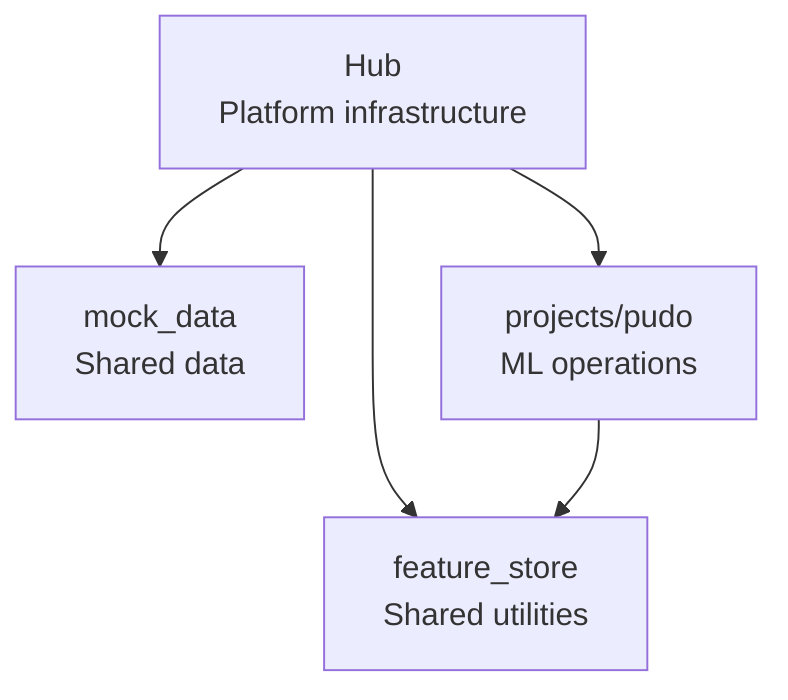

# Repo Layers & Ownership

## The hub-spoke architecture

This repository uses a **hub-spoke** architecture where platform infrastructure
is centralised and projects are independent:



## Ownership rule

> Hub and shared code may be referenced by projects. Projects may never be
> referenced by hub or shared code.

This rule ensures:

- **Hub stability**: the hub changes rarely and is owned by platform engineers.
- **Project independence**: each project can be developed, tested, and deployed
  without coordinating with other projects.
- **Clear dependency direction**: dependencies always point inward (project →
  hub/shared), never outward.

## Layer responsibilities

### Hub (`hub/`)

Creates and manages Snowflake platform objects:

| Responsibility | Snowflake objects |
|---|---|
| Database management | `PUDO_MLOPS` database |
| Schema provisioning | `SHARED_DATA`, `FEATURE_STORE_<ENV>`, `MODEL_REGISTRY_<ENV>` |
| Role management | Operational roles and grants |
| Compute provisioning | Warehouses, compute pools |

### Mock Data (`mock_data/`)

Generates and loads realistic test data:

| Responsibility | What it does |
|---|---|
| Data generation | PUDO locations, parcels, deliveries, occupancy |
| Simulation | Morning/evening cycles, temporal patterns |
| Seeding | Bulk load into `SHARED_DATA` schema |

### Projects (`projects/<name>/`)

Each project is an independent ML workload:

| Block | Responsibility |
|---|---|
| `feature_view/` | Entity definitions and feature view implementations |
| `training/` | Training DAG, model training, evaluation |
| `inference/` | Inference DAG, batch prediction, CLI tools |
| `core/` | Shared utilities (session, config, SQL helpers) |
| `config/` | YAML configuration with environment overlays |
| `scripts/` | Deployment and execution entry points |

## No root tooling

There is intentionally no root `pyproject.toml` or root `Makefile`. Each
component is fully self-contained:

- Its own Python dependencies (`pyproject.toml` + `uv.lock`).
- Its own operational targets (`Makefile`).
- Its own connection configuration (`.env`).

This means you always run commands from within a component:

```bash
make -C hub deploy-infra
make -C mock_data seed-shared-data
make -C projects/pudo deploy-schema
```

## Adding a new project

To add a new project spoke:

1. Create `projects/<name>/` following the project template.
2. Add a `pyproject.toml` with the required dependencies.
3. Add a `Makefile` with deploy and run targets.
4. Reference hub and shared code as needed (but never the reverse).

## See also

- [Environments & Promotion](environments-and-promotion.md) for how projects
  are deployed across environments.
- [Task Graphs & Orchestration](task-graphs-and-orchestration.md) for how
  project DAGs are structured.
