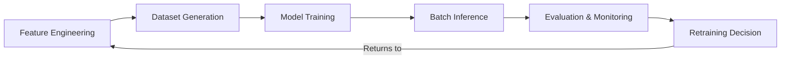

# Snowflake ML Lifecycle

This page explains the end-to-end ML lifecycle as implemented in this
repository using Snowflake ML capabilities.

## Lifecycle overview

## Stage 1: Feature Engineering

**What happens:** Raw data is transformed into ML-ready features.

**Snowflake components used:**

| Component | Role |
|---|---|
| Feature Store | Central registry for entities and feature views. |
| Entities | Primary keys that features are organised around (e.g., PUDO, PUDO_DATE). |
| Feature Views | Versioned collections of computed features. |

**Key concepts:**

- **Point-in-time correctness**: feature values are looked up as of a specific
  timestamp to prevent data leakage. This is implemented via ASOF JOINs.
- **Feature versioning**: feature views are versioned. Downstream consumers
  pin to specific versions through configuration.
- **Namespacing**: features are namespaced as `SHARED__*` (cross-project) or
  `<PROJECT>__*` (project-specific).

**Repository mapping:** `projects/<name>/feature_view/`

## Stage 2: Dataset Generation

**What happens:** Features are materialised into training datasets with proper
temporal splitting.

**Key concepts:**

- **Spine**: a list of (entity, timestamp) pairs that define the prediction
  context. Each row represents "what did we know at this point in time?"
- **ASOF JOIN**: for each spine row, look up feature values that existed at
  or before that timestamp. This is how point-in-time correctness is enforced.
- **Temporal split**: data is split by time (not randomly) into train,
  validation, and test sets. This prevents future data from leaking into
  training.

**Repository mapping:** `projects/<name>/training/ops.py` (dataset generation
task in the training DAG).

## Stage 3: Model Training

**What happens:** An XGBoost model is trained on the generated dataset.

**Snowflake components used:**

| Component | Role |
|---|---|
| Container Services | Runs distributed XGBoost training in containers. |
| Compute Pools | Provides GPU/CPU resources for training. |
| Model Registry | Registers trained models with metadata and metrics. |

**Key concepts:**

- **Distributed training**: XGBoost runs across multiple nodes in a compute
  pool for faster training on large datasets.
- **Model registration**: trained models are logged with version, metrics
  (RMSE, MAE, R²), and lineage information.
- **Configuration-driven**: training hyperparameters are controlled by YAML
  configuration with environment overlays.

**Repository mapping:** `projects/<name>/training/`

## Stage 4: Batch Inference

**What happens:** The trained model generates predictions for all PUDO
locations on a target date.

**Key concepts:**

- **Model loading**: the inference pipeline loads a specific model version from
  the registry (configurable, defaults to latest).
- **Feature generation**: inference-time features are computed from the feature
  store using the same feature views as training.
- **Prediction writing**: predictions are stored with metadata (model version,
  run timestamp, feature snapshot) for traceability.

**Repository mapping:** `projects/<name>/inference/`

## Stage 5: Evaluation & Monitoring

**What happens:** Predictions are compared to actual outcomes to assess model
quality.

**Key concepts:**

- **Prediction vs. actual comparison**: once actual values are available
  (after evening data), predictions are evaluated.
- **Error metrics**: RMSE, MAE, and per-PUDO breakdowns.
- **Alerting**: threshold-based alerts fire when prediction errors exceed
  acceptable bounds.
- **Drift detection**: monitoring for data drift (input distribution changes)
  and concept drift (relationship changes between features and target).

**Repository mapping:** `pudo-inference evaluate`, `pudo-inference alerts`,
`pudo-inference summary`.

## Stage 6: Retraining Decision

**What happens:** Based on evaluation results, a decision is made to retrain.

**Retraining triggers:**

| Trigger type | Description |
|---|---|
| Scheduled | Daily or weekly retraining on a fixed schedule. |
| Drift-based | Retrain when data drift or concept drift is detected. |
| Manual | Engineer-initiated retraining after code or configuration changes. |

The training DAG supports scheduling via Snowflake task graph schedules.

## Artifact lineage

Snowflake ML provides built-in lineage tracking:

- **Data lineage**: which tables and feature views contributed to a dataset.
- **Model lineage**: which dataset and hyperparameters produced a model.
- **Prediction lineage**: which model version and features produced a set of
  predictions.

This lineage is queryable through the Snowflake Model Registry and is valuable
for debugging, auditing, and compliance.

## See also

- [Feature Store](feature-store.md) for deeper feature engineering concepts.
- [Model Registry & Training Artifacts](model-registry-and-training-artifacts.md)
  for model management details.
- [Task Graphs & Orchestration](task-graphs-and-orchestration.md) for how
  lifecycle stages are automated.
