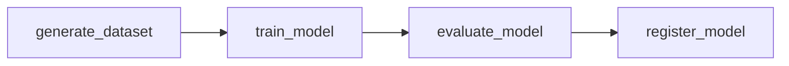
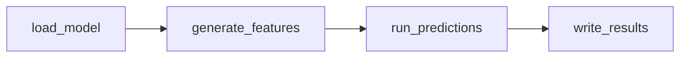

# Task Graphs & Orchestration

This page explains how Snowflake Task Graphs are used to orchestrate ML
pipelines in this repository.

## What are Snowflake Task Graphs?

Snowflake Task Graphs (DAGs) are a native Snowflake orchestration mechanism
that allows you to define dependencies between tasks and execute them in order.

Key properties:

- **Serverless**: no external orchestrator (Airflow, Prefect, etc.) required.
- **Native**: tasks run directly in Snowflake, close to the data.
- **Schedulable**: tasks can run on a cron schedule or be triggered manually.
- **Observable**: task history and status are queryable in Snowflake.

## The deploy-vs-run pattern

This repository uses a consistent **deploy-then-run** pattern:

```
deploy-training-dag     →  Creates/updates the task graph definition in Snowflake
run-training-dag        →  Triggers an immediate execution of the deployed graph
```

This separation is important because:

- **Deploy** is a code change. It updates what the pipeline does.
- **Run** is an execution. It runs the pipeline as currently defined.
- Deploy happens when an engineer runs the deploy target; run happens on schedule.

## Training DAG

The training DAG orchestrates the model training pipeline:



| Task | What it does |
|---|---|
| `generate_dataset` | Build spine, ASOF JOIN features, temporal split. |
| `train_model` | Run distributed XGBoost training via Container Services. |
| `evaluate_model` | Compute metrics on validation set. |
| `register_model` | Log model with metrics to the Model Registry. |

### Configuration

The training DAG is configured via YAML:

```yaml
# config/training/base.yaml
schedule: "0 2 * * *"   # Daily at 2 AM (for production)
compute_pool: PUDO_TRAINING_POOL
warehouse: PUDO_TRAINING_WH
```

## Inference DAG

The inference DAG orchestrates the batch prediction pipeline:



| Task | What it does |
|---|---|
| `load_model` | Retrieve model version from the Registry. |
| `generate_features` | Compute inference-time features from the Feature Store. |
| `run_predictions` | Apply model to feature matrix. |
| `write_results` | Store predictions with metadata. |

### CLI alternative

For ad-hoc runs and debugging, the `pudo-inference` CLI provides the same
functionality without the DAG:

```bash
pudo-inference run        # Equivalent to running the inference DAG
pudo-inference evaluate   # Post-inference evaluation
pudo-inference alerts     # Check alert conditions
pudo-inference summary    # Print summary
```

## Scheduling

Task graphs support Snowflake's native scheduling:

```sql
-- Set a daily schedule for the training DAG
ALTER TASK PUDO_DEV.TRAINING_DAG_ROOT SET SCHEDULE = 'USING CRON 0 2 * * * UTC';

-- Suspend or resume scheduling
ALTER TASK PUDO_DEV.TRAINING_DAG_ROOT SUSPEND;
ALTER TASK PUDO_DEV.TRAINING_DAG_ROOT RESUME;
```

In this repository, scheduling is typically configured during deployment via
the `deploy-training-dag` and `deploy-inference-dag` scripts.

## Monitoring

You can monitor task graph execution in Snowflake:

```sql
-- Recent task executions
SELECT *
FROM TABLE(INFORMATION_SCHEMA.TASK_HISTORY())
WHERE NAME LIKE 'TRAINING%'
ORDER BY SCHEDULED_TIME DESC
LIMIT 20;

-- Current task graph state
SHOW TASKS IN SCHEMA PUDO_DEV;
```

## Why not an external orchestrator?

This repository uses Snowflake Task Graphs instead of external tools (Airflow,
Prefect, Dagster) because:

- **Simplicity**: no additional infrastructure to manage.
- **Proximity**: tasks run close to the data, minimising data movement.
- **Cost**: uses existing Snowflake compute resources.
- **Governance**: all execution history is in Snowflake, queryable and
  auditable.

For teams that already use an external orchestrator or automation system, the
deploy scripts are plain `make` targets and can be called from any wrapper.

## See also

- [Snowflake ML Lifecycle](snowflake-ml-lifecycle.md) for how DAGs fit into
  the broader pipeline.
- [Environments & Promotion](environments-and-promotion.md) for how DAGs are
  deployed across environments.
