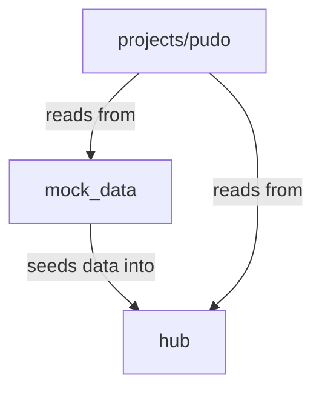

# Component Overview

A concise map of the repository's top-level components and their relationships.

## Component map

```
gls-snowflake-workshop/
│
├── hub/                    # Platform infrastructure
│   ├── src/hub/core/       #   Session, config, credentials, environment
│   ├── src/hub/infra/      #   Bootstrap, schema creation, SQL grants
│   ├── scripts/            #   deploy_infra.py
│   ├── config/             #   infrastructure.yaml
│   └── Makefile            #   deploy-infra
│
├── mock_data/              # Data simulation
│   ├── src/pudo_data/      #   Generators, CLI, config models
│   ├── scripts/            #   seed_shared_data.py
│   ├── config/             #   data_generation.yaml, infrastructure.yaml
│   └── Makefile            #   seed-shared-data, add-morning/evening-data, etc.
│
└── projects/pudo/          # Reference ML project
    ├── src/pudo/
    │   ├── core/           #   Session, config, SQL utils, registry helpers
    │   ├── feature_view/   #   Entities, feature views, feature store setup
    │   ├── training/       #   DAG definition, modeling, training job, ops
    │   └── inference/      #   DAG definition, ops, CLI, utils
    ├── scripts/            #   deploy_*.py, run_*.py
    ├── config/             #   YAML configs with environment overlays
    └── Makefile            #   deploy-*, run-*, evaluate, alerts, summary
```

## Dependency direction



- `hub` creates the platform that other components depend on.
- `mock_data` seeds data into `SHARED_DATA` (created by hub).
- `projects/pudo` reads from `SHARED_DATA`, uses feature stores and model
  registries (created by hub).

## Per-component Python environments

Each component has its own `pyproject.toml` and `uv.lock`:

| Component | Python version | Key dependencies |
|---|---|---|
| `hub` | 3.10 | snowflake-snowpark-python, pyyaml |
| `mock_data` | 3.10 | snowflake-snowpark-python, pyyaml, click |
| `projects/pudo` | 3.10 | snowflake-snowpark-python, snowflake-ml, xgboost, pyyaml, click |

## Per-component configuration

Each component has YAML configuration with environment overlays:

| Component | Config directory | Key configs |
|---|---|---|
| `hub` | `hub/config/` | `infrastructure.yaml` |
| `mock_data` | `mock_data/config/` | `data_generation.yaml`, `infrastructure.yaml` |
| `projects/pudo` | `projects/pudo/config/` | `feature_view/`, `training/`, `inference/`, `infrastructure.yaml` |

## Per-component entry points

Each component exposes operations through its `Makefile` and `scripts/`
directory. See the [Command Reference](command-reference.md) for the full
list of available targets.
