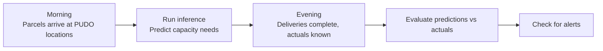

# Tutorial 7: Simulate, Evaluate & Alert

This tutorial simulates a realistic daily operational cycle: morning data
arrives, inference runs, evening data completes the picture, and then you
evaluate prediction quality and check for alerts.

## What you will learn

- How to simulate daily data cycles using the mock data generator.
- How to evaluate predictions against actual outcomes.
- How to check alert conditions and review summaries.

## Before you start

- [x] Inference has been run at least once
  ([Tutorial 6](06-deploy-and-run-inference.md)).

## The daily operational cycle

In a production PUDO system, a typical daily cycle looks like this:



The mock data generator simulates this cycle so you can test the full loop.

## Step 1: Add morning data

```bash
make -C mock_data add-morning-data
```

This simulates morning parcel arrivals at all PUDO locations. It advances the
simulation clock and generates new parcel and delivery attempt records.

## Step 2: Run inference on the new data

```bash
make -C projects/pudo run-inference
```

This generates predictions for the current simulation day using the latest
features from the feature store.

## Step 3: Add evening data

```bash
make -C mock_data add-evening-data
```

This simulates the completion of deliveries and records actual occupancy
values. Now you have both predictions and actuals for the same day.

## Step 4: Evaluate predictions

```bash
make -C projects/pudo evaluate-predictions
```

This runs `pudo-inference evaluate`, which:

1. Joins predictions with actual outcomes.
2. Computes error metrics (RMSE, MAE) per PUDO and overall.
3. Writes evaluation results to the project schema.

## Step 5: Check alerts

```bash
make -C projects/pudo inference-alerts
```

This runs `pudo-inference alerts`, which checks whether any PUDO locations
have prediction errors exceeding a configured threshold. If alerts are
triggered, they are logged for operational review.

## Step 6: View summary

```bash
make -C projects/pudo inference-summary
```

This runs `pudo-inference summary`, which prints a human-readable summary of
recent predictions, evaluation metrics, and any active alerts.

## Repeating the cycle

You can repeat steps 1–6 to simulate multiple days:

```bash
# Day 2
make -C mock_data add-morning-data
make -C projects/pudo run-inference
make -C mock_data add-evening-data
make -C projects/pudo evaluate-predictions
make -C projects/pudo inference-alerts
make -C projects/pudo inference-summary

# Day 3
make -C mock_data add-morning-data
# ... and so on
```

Each cycle adds a new day of data and a new set of predictions to evaluate.

## Checking simulation status

At any point, you can check the simulation state:

```bash
make -C mock_data simulation-status
```

## Resetting the simulation

If you want to start the simulation over:

```bash
make -C mock_data reset-simulation
```

Then re-seed and begin again from [Tutorial 3](03-seed-shared-data.md).

## What you have now

- [x] Understanding of the daily operational cycle.
- [x] Experience running morning/evening data simulation.
- [x] Experience evaluating predictions and checking alerts.
- [x] A repeatable workflow for testing the full inference loop.

## Next step

Continue to [Tutorial 8: Change Promotion & ML Lifecycle](08-change-promotion-and-ml-lifecycle.md)
to understand how Git changes map to Snowflake ML lifecycle stages.
