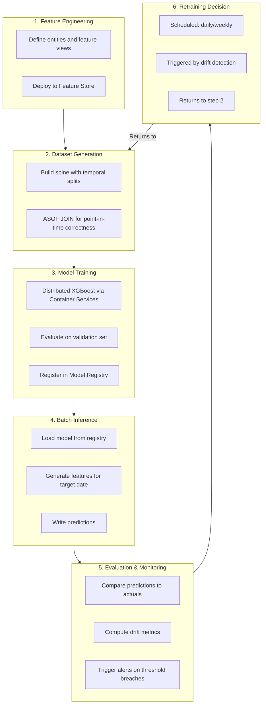

# Tutorial 8: Change Promotion & ML Lifecycle

This tutorial connects the operational workflows you have been running with the
broader ML lifecycle: how code changes flow through Git, how they map to
Snowflake environments, and how the full lifecycle is managed.

## What you will learn

- How the repository uses Git branches to select Snowflake environments.
- How a code change progresses from development to production.
- How code promotes from development to production via Git branches.
- What happens at each lifecycle stage: feature engineering, training,
  inference, evaluation.

## The Git-to-Snowflake mapping

The repository currently uses the **Git branch name** to determine which
Snowflake environment to target:

| Git branch | Snowflake environment | Config overlay |
|---|---|---|
| `dev` or `feature/*` | `DEV` | `dev.override.yaml` |
| `staging` or `release/*` | `STAGING` | `staging.override.yaml` |
| `main` | `PROD` | `prod.override.yaml` |

When you run `make -C projects/pudo deploy-schema`, the script reads the
current Git branch, resolves the environment, and merges the appropriate
configuration overlay.

## The ML lifecycle in this repository

The Snowflake ML lifecycle has several stages, each backed by repository
components:



## How code promotes through environments

A typical promotion flow:

### Development (feature branch)

1. Engineer creates a feature branch.
2. Makes changes to feature views, training code, or configuration.
3. Runs `make -C projects/pudo deploy-*` from the branch.
4. Changes are deployed to the `DEV` Snowflake environment.
5. Training and inference run against dev data.

### Staging (release branch)

1. Feature branch is merged into a release branch.
2. Engineer runs the deploy targets from the release branch.
3. Changes are deployed to the `STAGING` environment.
4. Training runs against staging data (larger, more realistic).
5. Model metrics are compared to the production baseline.

### Production (main branch)

1. Release branch is merged into `main`.
2. Engineer runs the deploy targets from `main`.
3. Changes are deployed to the `PROD` environment.
4. Production training DAG runs on schedule.
5. Inference DAG runs daily.
6. Monitoring and alerting are active.

This repository does not ship an automated CI/CD pipeline. Promotion today is
manual: the same `make` targets are run from the appropriate branch, and the
branch name selects the target environment.

## The configuration overlay system

At each stage, different configuration overlays are applied:

```yaml
# config/training/base.yaml (shared defaults)
train_days: 90
n_estimators: 500
learning_rate: 0.05

# config/training/dev.override.yaml (fast iteration)
train_days: 30
n_estimators: 50

# config/training/prod.override.yaml (full training)
train_days: 365
n_estimators: 1000
```

This means the same code runs in all environments, but with parameters
appropriate for each stage.

## What this means for your workflow

When you make a change:

1. **Test locally** against `DEV` using a feature branch.
2. **Validate** against `STAGING` using a release branch.
3. **Deploy** to `PROD` by merging to `main`.
4. **Monitor** production metrics and alerts.
5. **Retrain** when scheduled or when drift is detected.

## Connecting back to the tutorials

| Tutorial | ML lifecycle stage |
|---|---|
| [1: Bootstrap](01-prerequisites-and-snowflake-bootstrap.md) | Platform setup |
| [2: Mental Model](02-repo-mental-model.md) | Architecture understanding |
| [3: Seed Data](03-seed-shared-data.md) | Data foundation |
| [4: Feature Store](04-deploy-schema-and-feature-store.md) | Feature engineering |
| [5: Training](05-deploy-and-run-training.md) | Training + registration |
| [6: Inference](06-deploy-and-run-inference.md) | Batch inference |
| [7: Evaluate & Alert](07-simulate-morning-evening-and-evaluate.md) | Evaluation + monitoring |
| **This tutorial** | Lifecycle + branch-based promotion |

## Where to go from here

- Read the [Concepts](../concepts/index.md) section for deeper explanations of
  individual topics.
- Use the [Guides](../guides/index.md) for specific operational tasks.
- Refer to the [Command Reference](../reference/command-reference.md) for
  Makefile target details.
